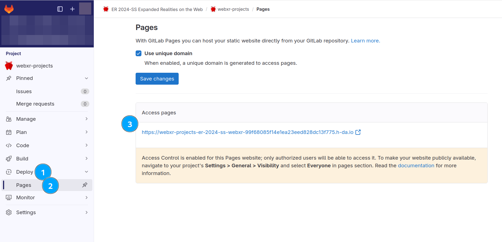
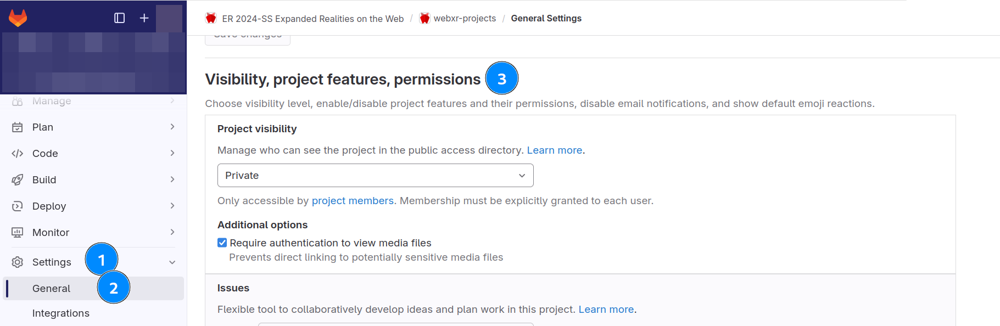
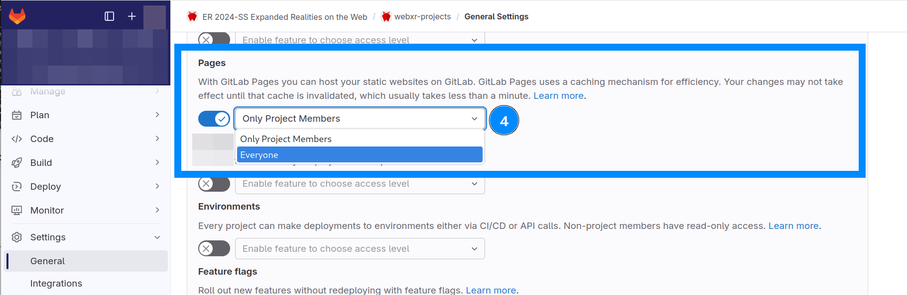

# webxr-projects

This repository will collect stuff you are writing for the Summer 2024 elective "Expanded Realities on the Web".

Feel free to create your own files and directories, this is your project.

## Hosting Pipeline

It has been set up to also publish this on the web. By default, this will be set to "project members only" which requires you to log in to view it.

### How to find your own URL

To find out where your project can be accessed, go to your project in Gitlab and find the menu entry "Deploy" &rarr; "Pages".

### Setting Letting everyone see this

But you can choose to publish for anyone without logging in, too. You can go to [Gitlab](https://code.fbi.h-da.de), find your project and hit "settings". This is in "General Settings" and is part of the "Visibility, project features, permissions" drop down menu.

  

